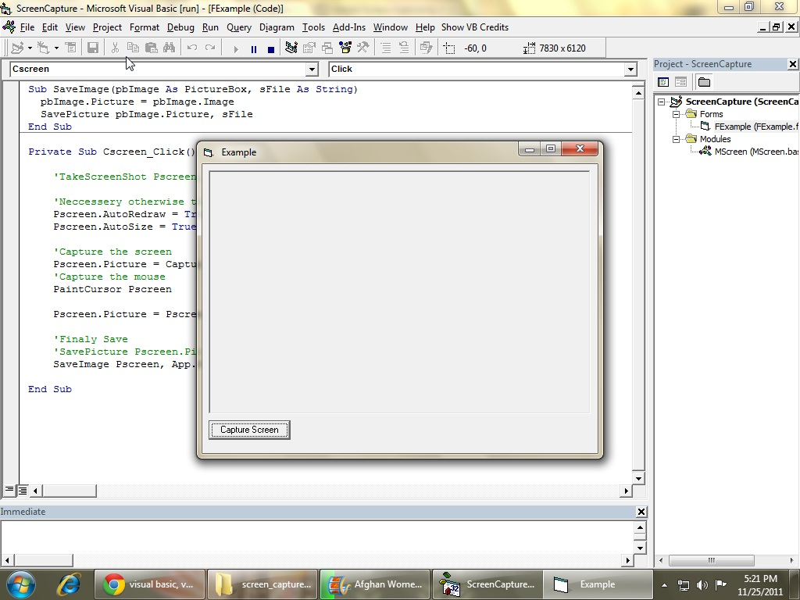



## Screen Shot/Capture \+ Mouse \+ No clipboard \+ No dll ocx

### Description

The original work is not mine, i was looking for such a code for a long time but couldn't find so finally i had to do it my self by combining codes from others in this site.

The original authors are!

Display Current Mouse Pointer Image By: Will Brendel CodeId=8252

Simple Screen Capture By: Rye CodeId=56877

Note: The cursor position is not accurate. if you figured it out please post the solution in the comment section below.

Thank you
 
### More Info
 

             |
---                |---
**Submitted On**   |2011-11-23 21:03:18
**By**             |[ufo973](https://github.com/Planet-Source-Code/PSCIndex/blob/master/ByAuthor/ufo973.md)
**Level**          |Intermediate
**User Rating**    |5.0 (20 globes from 4 users)
**Compatibility**  |VB 3\.0, VB 4\.0 \(16\-bit\), VB 4\.0 \(32\-bit\), VB 5\.0, VB 6\.0
**Category**       |[Miscellaneous](https://github.com/Planet-Source-Code/PSCIndex/blob/master/ByCategory/miscellaneous__1-1.md)
**World**          |[Visual Basic](https://github.com/Planet-Source-Code/PSCIndex/blob/master/ByWorld/visual-basic.md)
**Archive File**   |[Screen\_Sho22154811252011\.zip](https://github.com/Planet-Source-Code/ufo973-screen-shot-capture-mouse-no-clipboard-no-dll-ocx__1-74181/archive/master.zip)

